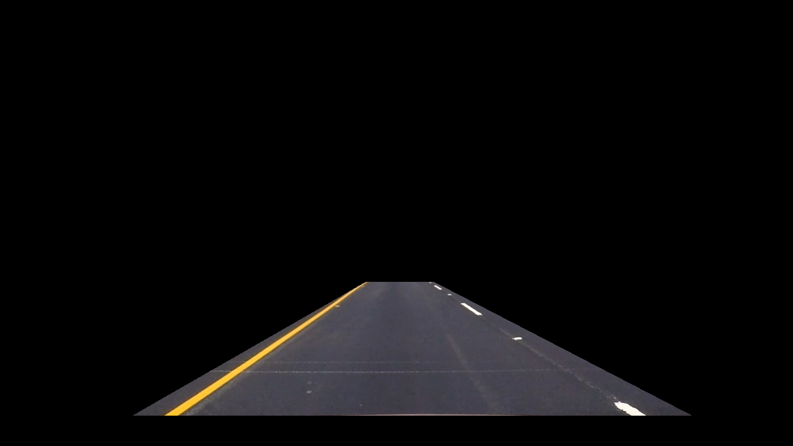

# Advanced Lane Tracking: Pipeline Development
---
## Introduction
This report describes the development and testing of a pipeline to detect and track lane lines within a video. An example image from a video feed is shown below.

The video frames use the camera calibration and distortion correction information conducted in the 'Camera Calibration and Detection' notebook, which are saved as a pickle file and loaded. The notebook 'Advanced Lane Detection Video Pipeline' contains the developed code that integrates the processing pipeline.

The pipeline is implemented in the following steps:
* Camera calibration matrix and distortion coefficients are estimated from a set of chessboard images at multiple perspectives. This is performed at initialization, and the calibration/distortion is assumed to hold for all further tests. The code to generate the calibration files is included in the 'Camera Calibration and Detection' notebook.
* Video feed is processed 'per frame' with:
    * Distortion correction is enable raw images.
    * Color space conversion to HSL.
    * Computer vision processing including color-channel thresholding and gradient estimation, are used to generate a thresholded binary image.
    * A shadow estimation filter is implemented to detect occluded pixels.
    * The binary image is transformed to a "birds-eye view" with a perspective transform.
    * Histogram, window-tracking and polynomial estimation operations are applied to detect lane pixels and to estimate the lane.
    * Lane estimates are re-projected into the original image for visualization.
    * Lane curvature and vehicle position are estimated from the fitted lanes and rendered as text onto the output frame.

The final video displays the lane boundaries and provides the numerical estimation of lane curvature and vehicle position.

Here is a link to the processed video file: [link to my video result](./test_videos_output/project_video.mp4)

[//]: # (Image References)

---

### Calibration Summary
Camera calbiration was perfromed by detecting the intersection of squares on a chessboard. The rows and columns of the chessboard allow joint estimation of the camera calibration/distortion and the camera extrinsic pose. A correctly calibrated camera frame will display a rectilinear grid, compared the to input frames which show significant distortion curvature in the horizontal/vertical lines.

The following images show the results of the Camera Calibration process:
* Image 1 shows the Uncalibrated image.
* Image 2 shows the identification of the chessboard pattern, using openCV findChessboardCorners
* Image 3 shows the distortion corrected image, using the calibration calcualted over all available calibration images.

The final undistorted image shows a rectilinear grid, with no significant curvature visible within the grid area. In the next step, the calibration is applied to a test image containing a straight section of road. A perspective transform is then performed to a'Birds-Eye View'.

Calibration was implemented using the following OpenCV functions: 
* findChessboardCorners: this function finds the chessboard corners within a supplied image.
* calibrateCamera: this function takes multiple frames worth of input point locations (chessboard corners in this instance) and calculates the extrinsic and intrinsic calibration parameters.

### Pipeline (single images)
#### Distortion-corrected image.
The scene image below shows an example of a video frame image that has been corrected. This image/frame would form the input to subsequent stages of the processing pipeline. The code to implement the perspective transform is located in the pipeline member functin "applyPerspective".

---

### BEV Projection

BEV projection is calculated by selecting a static region of interest for a camera frame, and assuming a linear relationship between the ROI and physical distance/perspective. In this instance, a vertical or 'Birds-eye-view' projection above the road is assumed, such that the selected region of interest is re-projected to a flat plane. A geometric distortion is applied to invert the camera perspective: this results in vertical lane lines in the BEV image, as shown in the images below.

The OpenCV function "getPerspectiveTransform" can be then used to compute the forward and inverse perspective transformation

#### Color and Gradient Transformations.
The implemented pipline applied the following image processing operations to isolate lane lines:
* Color space conversion and threshold: The images were converted to HLS color space. Thresholding was applied to isolate color space values within the below ranges. The output was the sum of the channel greyscale values.
    * L channel: 200 - 255,
    * S channel: 150 - 255.
* Gradient Detection: After BEV projection, an X-direction gradient filter isolates 'vertical' lines within the scene using a Sobel gradient kernel in the X direction. The kernel size was selected to be 15 pixels.

The code to implement the color space operations is included in the function "thresholdImage" and "hlsSelectGrey". The Gradient filter is implemented in "getLines". Line identification was implemented in "detectLanesBEV".

The following images show the output of the color processing on a test image. The first image shows the greyscale output resulting from colorspace filtering. The second image shows the edge detection output (after BEV perspective). The final image shows the identified lines.

####  Lane-line detection

The lane lines were easily identified within the thresholded images. To detect the left and right lanes, a vertical histogram was used to initialize the center of each lane estimate, as projected to the bottom of the BEV image. Candidate selection was based upon max number of pixels in a column for the left and right halves respectively. A series of 9 windows were then used to track the center of mass of the lane verticall in the image. The lane lateral trajectory was up updated in each widow if the number of greyscale-weighted pixels exceeded a threshold, in this case 30 pixels.

Importantly, the windowing algorithm was processed using greyscale values for each pixel. This provides additional information relative to the binary threshoding proposed by the notes. In practice, the greyscale weighting de-empahsises pixels that are considered 'low probaility' of being a lane pixel by the thresholding stages ( a 'bright' pixel is assumed to be lane pixel with high likelihood).

After pixel identification and coarse trajectory optimization, all greyscale pixels within theing +- 100 pixels of the candidate lane were used to fit a polynomial. The left and right polynomial fits describes the pixel x-location vs y-height for the left and right lane lines respectively. The greyscale intensity of the pixels was used as a weighting funtion for the least-squares regression to reduce noise sensitivity.

The below image projects the left (red) and right (green) lane lines are identified. In a subsequent step, a polynomial is fit to the pixels belowinging to each line.

#### Radius of curvature and  position .

A dedicated class was used to represent each lane line. The class estimates the curvature of the lane line from the polynomial. The physical scale is known from the BEV projection, where the lanes are appoximately 3.7 m wide over a total (vertial) legth of 35 m. This gives the calibrate scale for the x and y axis of the polynomial. The seccond derivative of the fitted curve is the used to infer the radius of curvature. 

Offset is similarly implied from the horizontal intersect of the lane lines in the BEV projection. Assuming the camera was centered in the vehicle, the average 'x' value for the polynomial fit indicates the 'middle' of the lane in the image. It is then simple to compare the 'lane' middle position to the expected position in the center of the image to determine translation. The lateral scale factor was then used to calibrate the offset to meters. 

#### Identified Lanes

ONce identified and projected onto the BEV perspective, the Identified lane area could be re-projected in to the original image space using the inverse perspective transform that converts BEV to camera perspective. The final result is shown below, including rendering of the estimated radius of curvature and offset information.

#### Final Processed Video

Here is a link to the processed video file: [link to my video result](./test_videos_output/project_video.mp4)

---

### Discussion

#### Issues Faced
When implementing the pipeline, the decision to use greyscale values for detection process provided several benefits, namely the integration of likelihood/reliability information into the detction and fit process, however the algorithm conversion from binary to int required fine tuning. In particular, image normalization was required to correctly condition the thresholding for the (empirically tuned) tracking-window algorithm implemented for lane identification. 

In addition, building a reliable color-space filter was challenging until a dedicated 'shadow' detection channel was implemented. This used RGB color space information to isolate shadow/dark pixels with low information that were contaminating performance once converted to HLS.

Lastly, the lane-line averaging introduces intertia into the system. The number of frames used to generate a stable estimate was tuned to provide a reliable estimate of the lane position whilst maintaining responsivity under changing curvature/offset.

#### Pipeline Failure
Currently, the pipeline is empirically tuned to work in well-lit conditions, with a small number of frame occluded/impaired by shadows. Any change in road conditions, such as the challenge video, where the line intensity changed significantly would impair the pipeline. In addition, the presence of supurious 'vertical lines' in the BEV edge image, such as caused by changes in road surface, will also impair operaiton. In particular, frames where the changing road surface crosses the lane line will possibly cause the lane detection algorithm to confuse the two lines and may lead the window algorithm to 'lock' onto an incorrect line gradient.

Fixing this operation would require further tuning of the edge detection algorithm and color space filtering. The greyscale 'information' approach already implemented would likely improve this approach, relative to a threshold/binary implementation.
